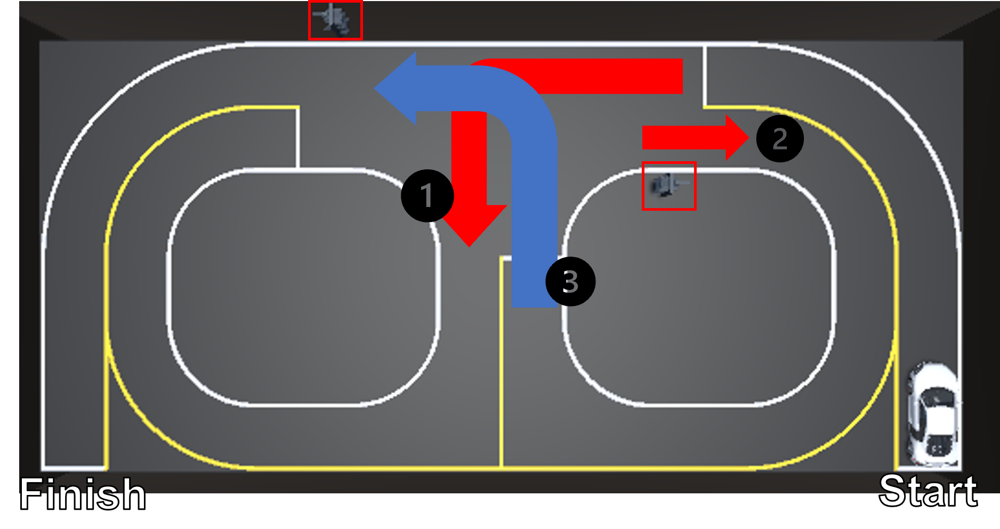
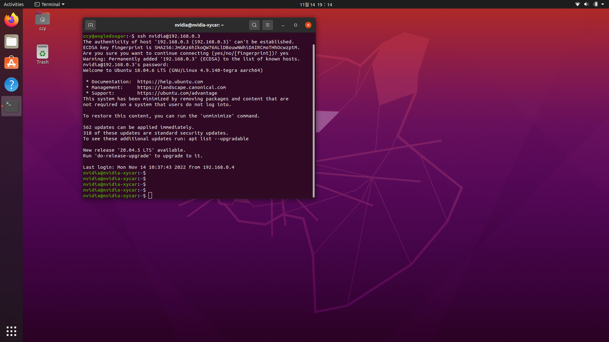

# Assignmnet2 : Sim to Real
<p align="center"></p>   

In Unity simulation, we used Opencv to recognize lines and traffic lights for Xycar autonomous driving. Can we use the simulation method in the real world as it is? Identify and solve the gap in Sim to Real.  

### **Deadline : 22.11.08 ~ 22.12.01**
## **How to connect Xycar**

### (1) Connect wifi "RAISE_project" from remote PC
``` bash
WiFi : RAISE_project  
PWD : engineers  
```
<details>
<summary>If you use [Windows + WSL2]</summary>

```bash
# Make C:\wsl and move wsl1.ps1
PS C:\wsl> PowerShell.exe -ExecutionPolicy Bypass -File .\wsl1.ps1
```
```bash
# wsl.ps1
$remoteport = bash.exe -c "ifconfig eth0 | grep 'inet '"
$found = $remoteport -match '\d{1,3}\.\d{1,3}\.\d{1,3}\.\d{1,3}';

if( $found ){
  $remoteport = $matches[0];
} else{
  echo "The Script Exited, the ip address of WSL 2 cannot be found";
  exit;
}

#[Ports]
#All the ports you want to forward separated by coma
$ports=@(20, 22, 80, 1000, 11311, 2000,3000,5000,8000,8002,8080);


#[Static ip]
#You can change the addr to your ip config to listen to a specific address
$addr=(Get-NetIPAddress -AddressFamily IPv4 -InterfaceAlias Wi-Fi).IPAddress;
$ports_a = $ports -join ",";


#Remove Firewall Exception Rules
iex "Remove-NetFireWallRule -DisplayName 'WSL 2 Firewall Unlock' ";

#adding Exception Rules for inbound and outbound Rules
iex "New-NetFireWallRule -DisplayName 'WSL 2 Firewall Unlock' -Direction Outbound -LocalPort $ports_a -Action Allow -Protocol TCP";
iex "New-NetFireWallRule -DisplayName 'WSL 2 Firewall Unlock' -Direction Inbound -LocalPort $ports_a -Action Allow -Protocol TCP";

for( $i = 0; $i -lt $ports.length; $i++ ){
  $port = $ports[$i];
  iex "netsh interface portproxy delete v4tov4 listenport=$port listenaddress=$addr";
  iex "netsh interface portproxy add v4tov4 listenport=$port listenaddress=$addr connectport=$port connectaddress=$remoteport";
}
iex "netsh interface portproxy show v4tov4";
```
</details>
  
### (2) Check xycar id  
```bash
Xycar-X-10{xycar_num}-WXK    
```

### (3) SSH connect
<p align="center"></p>  

```bash
$ ssh nvidia@192.168.0.{xycar_num}

# example
$ ssh nvidia@192.168.0.8
$ ssh nvidia@192.168.0.10

# ssh id : nvidia  
# Password : nvidia  
```
```bash
# If you connect ssh nvidia-xycar complete
nvidia@nvidia-xycar:~$
```

## Run
``` bash
# 1
# xycar
nvidia@nvidia-xycar:~$ nano ~/.bashrc
```
``` bash
# ~/.bashrc
# Change ROS_MASTER_URI
# 6, 7, 8, 9, 10 is xycar ip
# Check your remote PC ip
# Windows : ipconfig
# Ubuntu : ifconfig
export ROS_MASTER_URI=http://192.168.0.{your_IP}:11311
export ROS_HOSTNAME=localhost
```
``` bash
nvidia@nvidia-xycar:~$ source ~/.bashrc
```
``` bash
# 2
# xycar
nvidia@nvidia-xycar:~$ roslaunch robotvision driving.launch
```
``` bash
# 3
# WSL or Ubuntu
$ rosrun assignment1 real_driving.py
```


