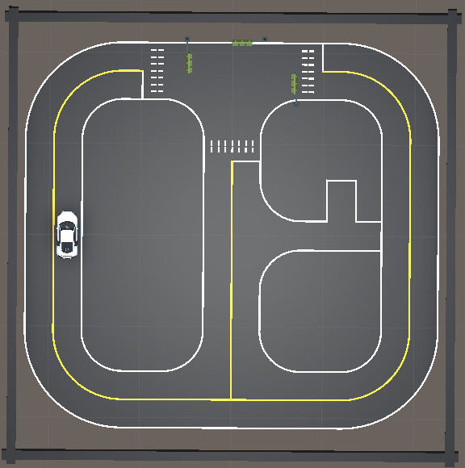
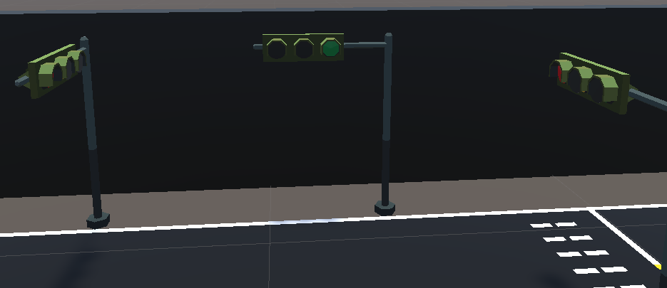
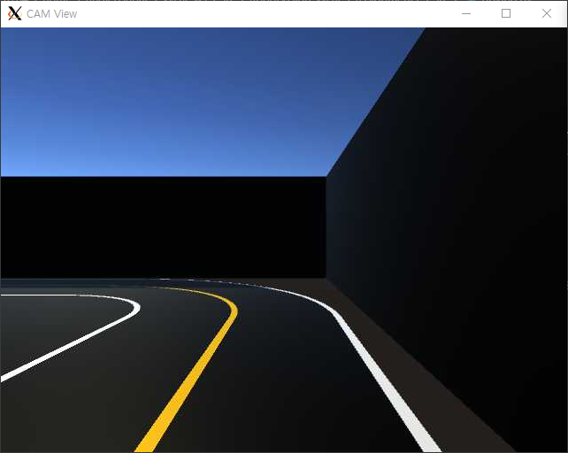
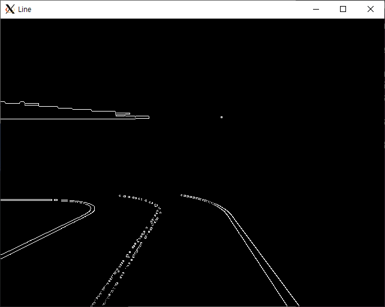
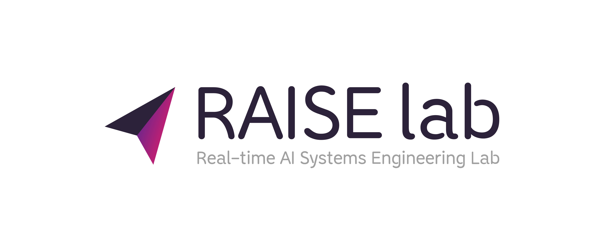

# RobotVision_xycar 
## Robot Vision System - xycar
이 실습자료는 한양대학교 ERICA 로봇비전시스템, 비전시스템설계 교육 목적으로 제작 되었습니다. 로봇비전시스템은 로봇을 이용한 머신 비전 시스템으로 다양한 로봇 Task를 수행하는 고속/고정밀도, 실시간 시각 센서 시스템입니다.  Xytron 사의 Xycar-X 모델을 이용하여 자율주행자동차 로봇비전시스템을 학습합니다.  
실습 설치 및 문제 발생 시 Github Issue 혹은 담당 조교 최찬역(angledsugar@hanyang.ac.kr) 문의 바랍니다.  

<p align="center"></p>  
<p align="center"></p>  

## Getting Started Guide
Nvidia AGX Xavier installed in Xycar is called Single-board computer (SBC). Your Computer is called PC. Data from many sensor installed in Xycar sent to the SBC. If you want see sensor data, you do connect your PC to SBC.  Nvidia AGX Xavier OS is Jetpack 4.2.3 & ROS1 Melodic. 
Recommend PC OS is Ubuntu 18.04 & Windows10 or 11.

[1. Windows 10 + WSL2](https://github.com/Angledsugar/RobotVision_xycar/blob/a95447f111f7eddc6815551fd05d98336b0695bf/GettingStartedGuide/windows.md)  
[2. Ubuntu 18.04](https://github.com/Angledsugar/RobotVision_xycar/blob/a95447f111f7eddc6815551fd05d98336b0695bf/GettingStartedGuide/ubuntu.md)   

## Windows 실행 방법
 
1. Check Host IP (eth0: intet 000.000.000.000)
```bash
# WSL2
$ ifconfig  
# Windows
PS > wsl hostname -I
```
2. Run Robotvision_Xycar     
```bash
# (1) WSL2 Terminal 1 
$ roslaunch rosbridge_server rosbridge_websocket.launch
```  
```bash  
# (2) Use Windows Terminal or Click .exe
# Unity is on, Input Host IP(WSL2 IP). => "ws://{000.000.000.000}:9090" and Press "Enter".
PS > (your directory)/RobotVision_xycar/Build/Windows/Start/RVS_start.exe

# If you input right host ip, ros can connect RVS. 
PS > (your directory)/RobotVision_xycar/Build/Windows/Xycar/RVS.exe

```
```bash
# (3) WSL2 Terminal 2 
$ roslaunch assignment1 driving.launch   
```

## Ubuntu 실행 방법  
```bash
# (1) Terminal 1 
$ roslaunch rosbridge_server rosbridge_websocket.launch
```  
```bash  
# (2) Terminal 2
# Unity is on, Input Ubuntu IP(localhost). => "ws://localhost:9090" and Press "Enter".
$ ~/xycar_ws/src/RobotVision_xycar/Build/Linux/Start/RVS_start.86_64

# If you input right host ip, ros can connect RVS. 
$ ~/xycar_ws/src/RobotVision_xycar/Build/Linux/Xycar/RVS.86_64

```
```bash
# (3) Terminal 3
$ roslaunch assignment1 driving.launch   
```

# Assignment1 : OpenCV로 차선, 신호등 인식하기

  
  
If you control the robot right away in the real world, there are many problems. The cost of researching robots is high, but we don't know what problems will arise because the code we wrote doesn't work perfectly at once. To solve this problem, we create a Simulation environment and test the code.

### **Deadline : 22.11.08 ~ 22.12.01**
   
[1] Image Read  
```bash
Image : OpenCV-ImageRead.png  
Line >> img = cv2.line(img, (0,0), (511, 511), (255, 0, 0), 5)  
Rectangle >> img = cv2.rectangle(img, (100,100), (300,500), (0,255,0), 3)  
Circle >> img  = cv2.circle(img, (300,400), 100, (0,0,255), 2)  
Text >> cv2.putText(img, 'Test', (10,50), cv2.FONT_HERSHEY_SIMPLEX, 4, (255,255))  
Image file read >> img = cv2.imread('picture.jpg', cv2.IMREAD_GRAYSCALE)   
Image show >> cv2.imshow('Color', img)   
Image save >> cv2.imwrite('new_image.jpg', img)
```   
[2] Gray Scale  
[3] Gaussian Blur  
[4] HSV -Binary  
[5] ROI  

# Assignmnet2 : Sim to Real
<p align="center"></p>   

In Unity simulation, we used Opencv to recognize lines and traffic lights for Xycar autonomous driving. Can we use the simulation method in the real world as it is? Identify and solve the gap in Sim to Real.  

### **Deadline : 22.11.08 ~ 22.12.01**

# Reference
1. [ENet: A Deep Neural Network Architecture for Real-Time Semantic Segmentation](https://arxiv.org/pdf/1606.02147.pdf)


# Author
**Chanyeok Choi**    
**Hojoon Choi**   
**Yuhyun Kim**    
**Youngmoon Lee***   
  

